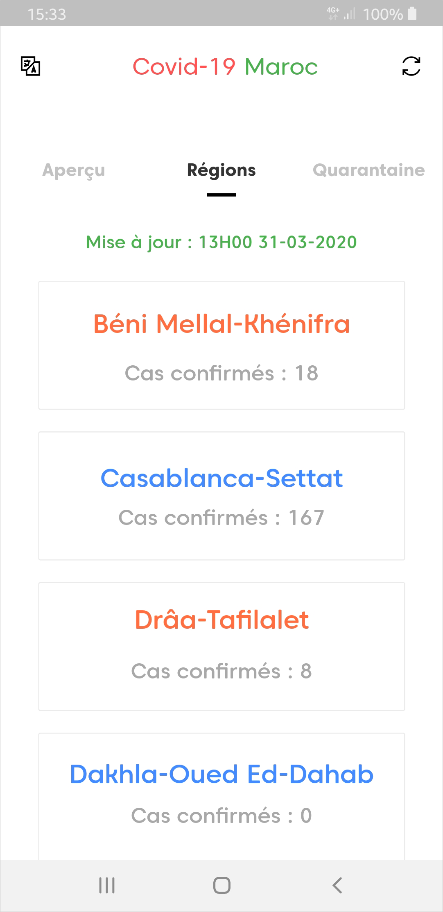

# Flutter App - Covid-19

Covid-19 is a mobile app to track the latest Coronavirus updates in Morocco.

## 📱 Android APK

Click [here](https://github.com/m-jabrane/Covid-19/raw/master/apk/Covid-19.apk) to download the application for Android.

## 📸 Screenshots

   

## Author(s)

**Mustapha JABRANE**

## Project

**Note**: Make sure your Flutter environment is setup.

In the command terminal, run the following commands:

    $ git clone https://github.com/m-jabrane/Covid-19.git
    $ cd Covid-19/
    $ flutter packages get
    $ flutter run

##### Check out Flutter’s online [documentation](http://flutter.io/) for help getting started with your Flutter project.